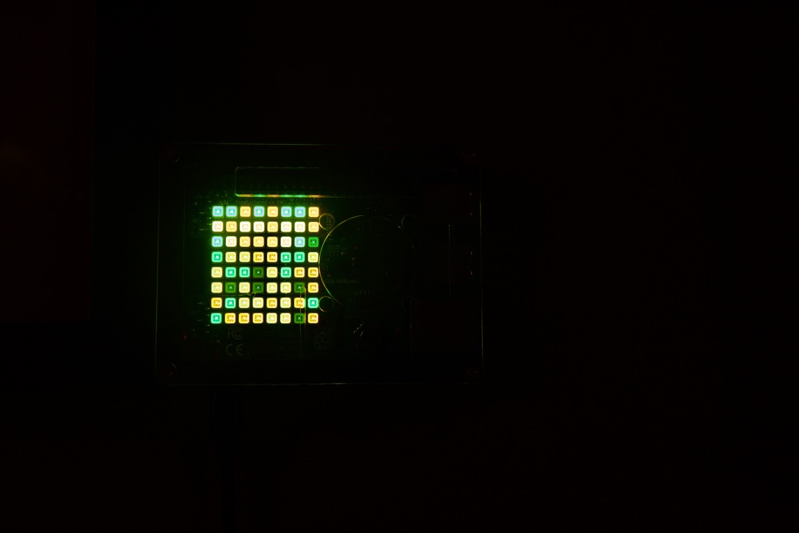

# Contribution Hat

Github Contribution Graph on the Raspberry Pi Sense Hat LED Matrix



## Setup

Using docker and docker compose, this is a super easy setup. Just do the following:

1. Run `init.sh` using `sh init.sh`
2. Put your Github user name (e.g. Matt-Gleich) in `~/contribution-hat-config/config.yaml`
3. Put your timezone ([TZ Database Name](https://en.wikipedia.org/wiki/List_of_tz_database_time_zones), e.g. America/New_York) in `~/contribution-hat-config/config.yaml`
4. Then just run `docker-compose up -d` at the root of this project

## Features

---

### Colors

Due to the fact that the classic green colors that github.com uses look too similar on the sense hat, the following color rules are used (percent is percent of max number of contributions for the year for the user):

| Percent | Color                                                                    |
| ------- | ------------------------------------------------------------------------ |
| 0%      |         |
| < 25%   |      |
| < 50%   |      |
| < 75%   |       |
| <= 100% |  |

---

### Night Mode

Set a list of hours for the lights to go off in Military time. Below are the setup steps:

1. Add `off-hours: list of hours` to `~/contribution-hat-config/config.yaml`

Below is an example

```yaml
username: "Matt-Gleich"
timezone: "America/New_York"
off-hours:
  - 1
  - 2
  - 3
  - 4
  - 5
  - 6
  - 21
  - 22
  - 23
  - 24
```

Restart by running `docker-compose down` and `sudo reboot`

## Teardown

Simply run `./teardown.sh` by running `sh teardown.sh`
